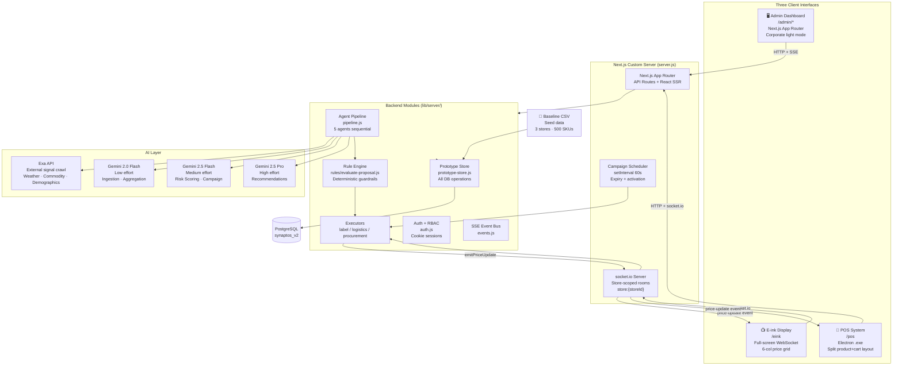
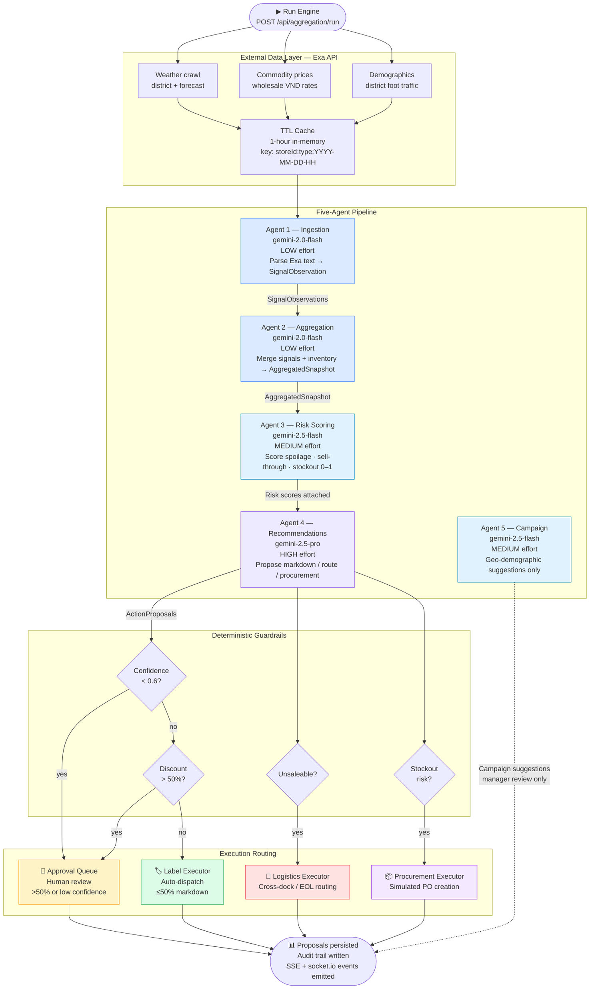
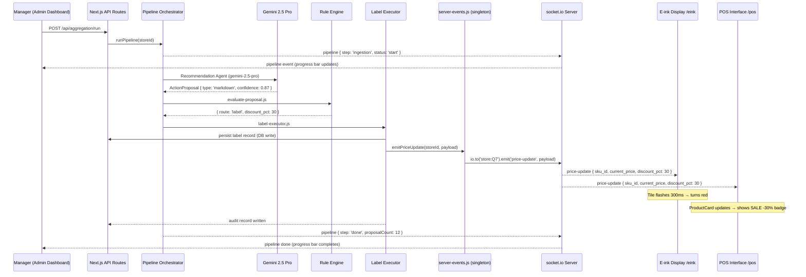
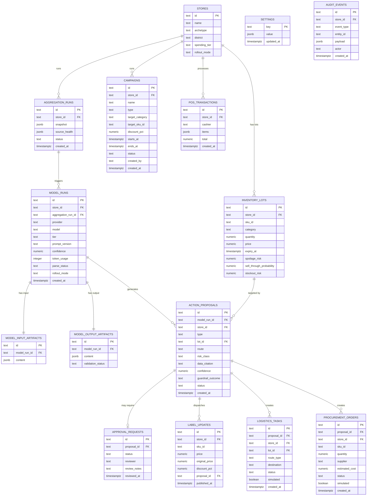
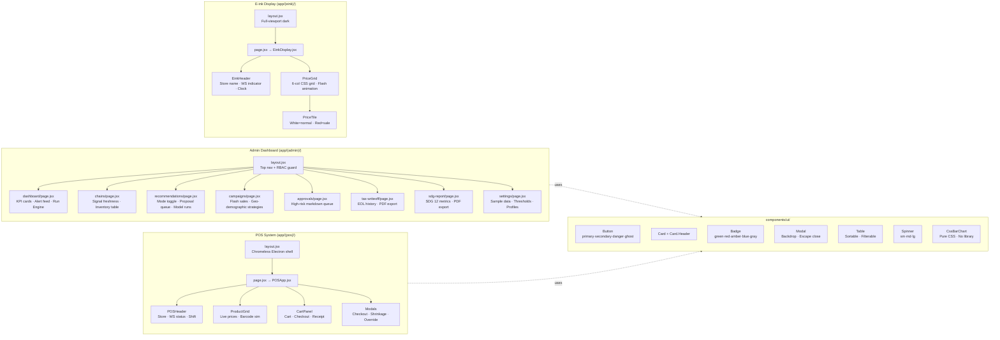
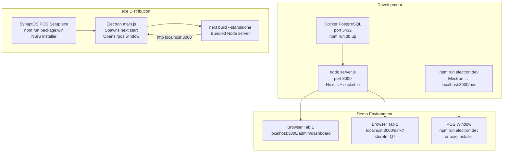
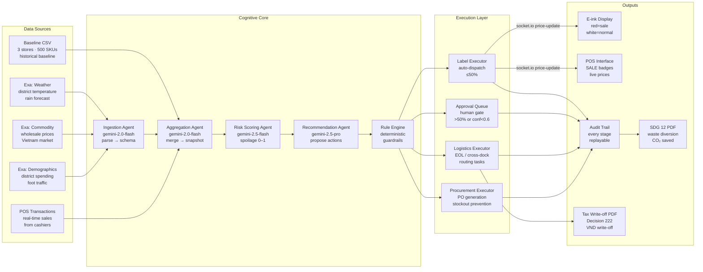

# SynaptOS Architecture

**Version:** v3 — Full Overhaul
**Date:** 2026-04-17
**Stack:** Next.js 15 · React 19 · PostgreSQL · socket.io · Electron · Gemini · Exa API

---

## 1. System Overview



---

## 2. Multi-Agent Pipeline



---

## 3. Real-Time Price Update Flow



---

## 4. Database Schema



---

## 5. Interface Architecture



---

## 6. Deployment Topology



---

## 7. Data Flow — End to End



---

## 8. Role-Based Access Control

```mermaid
graph TD
    subgraph ROLES["Operational Hierarchy"]
        ADMIN_ROLE["🔑 Admin / Chain HQ\n'God Mode'\nAll permissions"]
        MANAGER_ROLE["🛡️ Store Manager\n'Gatekeeper'\nApprove · Reject · Calibrate"]
        STAFF_ROLE["👤 Staff / Cashier\n'Execution'\nRead-only + POS checkout"]
        PROC_ROLE["📦 Procurement Planner\nProcurement console access"]
        LOGI_ROLE["🚚 Logistics Coordinator\nLogistics workbench access"]
    end

    subgraph PERMISSIONS["Permissions by Interface"]
        P1["Run Recommendation Engine"]
        P2["Approve / Reject Proposals"]
        P3["Create Campaigns"]
        P4["Export Tax Write-off PDF"]
        P5["Export SDG Report PDF"]
        P6["Reset Sample Data"]
        P7["POS Checkout"]
        P8["Shrinkage Input"]
        P9["Manager PIN Override"]
        P10["View Procurement Console"]
        P11["View Logistics Workbench"]
        P12["Modify Thresholds"]
    end

    ADMIN_ROLE --> P1 & P2 & P3 & P4 & P5 & P6 & P7 & P8 & P9 & P10 & P11 & P12
    MANAGER_ROLE --> P1 & P2 & P3 & P4 & P5 & P7 & P8 & P9
    STAFF_ROLE --> P7 & P8
    PROC_ROLE --> P10
    LOGI_ROLE --> P11
```



---

## 9. File Structure

```
syntaptos/
├── server.js                          ← Custom Next.js + socket.io server
├── next.config.mjs                    ← standalone output for Electron prod
├── package.json                       ← added: socket.io, electron, jspdf, exa-js
├── docker-compose.postgres.yml        ← unchanged
│
├── electron/
│   ├── main.js                        ← BrowserWindow → /pos, dev+prod split
│   ├── preload.js                     ← exposes storeId via contextBridge
│   └── electron-builder.yml          ← NSIS .exe config
│
├── app/
│   ├── (admin)/
│   │   ├── layout.jsx                 ← top nav + RBAC guard
│   │   ├── dashboard/page.jsx
│   │   ├── chains/page.jsx
│   │   ├── recommendations/page.jsx
│   │   ├── campaigns/page.jsx
│   │   ├── approvals/page.jsx
│   │   ├── tax-writeoff/page.jsx
│   │   ├── sdg-report/page.jsx
│   │   └── settings/page.jsx
│   ├── (pos)/
│   │   ├── layout.jsx                 ← chromeless shell
│   │   └── page.jsx
│   ├── (eink)/
│   │   ├── layout.jsx                 ← full-viewport dark
│   │   └── page.jsx
│   └── api/                           ← existing 16 route groups (unchanged)
│       ├── campaigns/route.js         ← NEW
│       ├── campaigns/[id]/route.js    ← NEW
│       ├── campaigns/suggest/route.js ← NEW
│       ├── settings/route.js          ← NEW
│       ├── eol-events/route.js        ← NEW
│       ├── metrics/sdg/route.js       ← NEW
│       └── pos/transaction/route.js   ← NEW
│
├── components/
│   ├── ui/                            ← Button, Card, Badge, Modal, Table, Spinner, CssBarChart
│   ├── admin/                         ← KpiCard, AlertFeed, PipelineProgress, SignalFreshnessPanel
│   │                                     InventoryTable, ProposalTable, ModelRunDrawer
│   │                                     ApprovalCard, CampaignCreateModal, GeoStrategyCard
│   ├── pos/                           ← POSApp, POSHeader, ProductGrid, ProductCard
│   │                                     CartPanel, CheckoutModal, ShrinkageModal, ManagerOverrideModal
│   └── eink/                          ← EinkDisplay, EinkHeader, PriceGrid, PriceTile
│
├── lib/
│   ├── server/
│   │   ├── server-events.js           ← NEW: socket.io singleton emitter
│   │   ├── campaign-scheduler.js      ← NEW: 60s interval expiry + activation
│   │   ├── agent/
│   │   │   ├── exa-client.js          ← NEW: Exa SDK + 1h TTL cache
│   │   │   ├── pipeline.js            ← NEW: 5-agent sequential orchestrator
│   │   │   ├── agents/
│   │   │   │   ├── ingestion-agent.js    ← NEW: gemini-2.0-flash
│   │   │   │   ├── aggregation-agent.js  ← NEW: gemini-2.0-flash
│   │   │   │   ├── risk-scoring-agent.js ← NEW: gemini-2.5-flash
│   │   │   │   ├── recommendation-agent.js ← NEW: gemini-2.5-pro
│   │   │   │   └── campaign-agent.js     ← NEW: gemini-2.5-flash
│   │   │   ├── client.js              ← unchanged
│   │   │   ├── orchestrator.js        ← unchanged
│   │   │   ├── prompt-builder.js      ← unchanged
│   │   │   ├── provider-registry.js   ← EXTENDED: add getModelForTier()
│   │   │   ├── response-parser.js     ← unchanged
│   │   │   ├── schemas.js             ← unchanged
│   │   │   └── validate-proposals.js  ← unchanged
│   │   ├── aggregation/               ← unchanged
│   │   ├── rules/                     ← unchanged
│   │   ├── execution/
│   │   │   ├── label-executor.js      ← EXTENDED: add emitPriceUpdate call
│   │   │   ├── logistics-executor.js  ← unchanged
│   │   │   └── procurement-executor.js ← unchanged
│   │   ├── prototype-store.js         ← EXTENDED: 3 new tables + helpers
│   │   ├── auth.js                    ← unchanged
│   │   └── events.js                  ← EXTENDED: pipeline event types
│   └── client/
│       └── pdf/
│           ├── tax-writeoff-pdf.js    ← NEW: jspdf client-side generator
│           └── sdg-report-pdf.js      ← NEW: jspdf client-side generator
│
└── docs/
    └── superpowers/specs/
        └── 2026-04-17-synaptos-full-overhaul-design.md
```

---

## 10. Key Architectural Principles

| Principle | Implementation |
|---|---|
| **Model output is advisory only** | Gemini proposals pass through `evaluate-proposal.js` before any execution |
| **Deterministic execution authority** | Rule engine is the sole gatekeeper — no agent can dispatch directly |
| **No hallucination** | `temperature: 0` on all calls · strict JSON schema validation · `null` for missing fields |
| **Tiered AI cost** | Low-effort Flash for parsing · Mid-effort Flash for scoring · High-effort Pro for reasoning |
| **Honest runtime states** | SIMULATED / CACHED / LIVE badges on all sources and executors |
| **Additive rollout** | Legacy mode preserved · shadow → assisted → live progression |
| **Full auditability** | Every stage (aggregation → agent → guardrail → execution) writes an audit record |
| **Store-scoped real-time** | socket.io rooms `store:{storeId}` prevent cross-store price bleed |
| **Human in the loop** | >50% discount + low confidence (<0.6) → mandatory human approval |
| **Campaign safety** | Campaign Agent suggestions are never auto-applied · manager must explicitly confirm |
