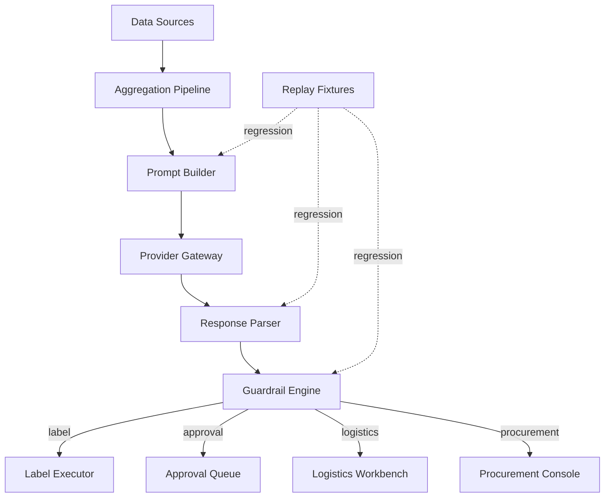

# SynaptOS Control Tower — Implementation Completion Summary

## Status: All 73 Tasks Complete ✅

All 9 phases of the implementation plan are now **fully implemented** and the production build passes cleanly.

## Phase Completion

| Phase | Name | Tasks | Status |
|-------|------|-------|--------|
| 1 | Setup | T001–T005 | ✅ Complete |
| 2 | Foundational | T006–T012 | ✅ Complete |
| 3 | US1 — Control-Tower Monitoring | T013–T021 | ✅ Complete |
| 4 | US2 — Safe Automated Markdown | T022–T036 | ✅ Complete |
| 5 | Model Observability and Policy | T037–T041 | ✅ Complete |
| 6 | US3 — Human Review For High-Risk Actions | T042–T050 | ✅ Complete |
| 7 | US4 — Unsaleable Inventory Routing | T051–T058 | ✅ Complete |
| 8 | US5 — Stockout Prevention | T059–T066 | ✅ Complete |
| 9 | Production Hardening and Documentation | T067–T073 | ✅ Complete |

## What Was Built This Session

### T069 — Seeded Replay and Evaluation Fixtures

Created `lib/server/agent/__fixtures__/` with four files:

| File | Purpose |
|------|---------|
| [scenarios.js](file:///c:/Users/power/Desktop/syntaptos/lib/server/agent/__fixtures__/scenarios.js) | 6 seeded scenarios covering all 5 user stories + stale-sources edge case |
| [provider-responses.js](file:///c:/Users/power/Desktop/syntaptos/lib/server/agent/__fixtures__/provider-responses.js) | 9 provider response fixtures (6 valid + 3 failure cases) |
| [replay-runner.js](file:///c:/Users/power/Desktop/syntaptos/lib/server/agent/__fixtures__/replay-runner.js) | Self-contained pipeline runner (prompt → parse → guardrail) |
| [index.js](file:///c:/Users/power/Desktop/syntaptos/lib/server/agent/__fixtures__/index.js) | Convenience re-exports |

**New API endpoint:** [app/api/agent/replay/route.js](file:///c:/Users/power/Desktop/syntaptos/app/api/agent/replay/route.js) — admin-only `GET /api/agent/replay` to trigger regression checks.

### Scenario Coverage

| Scenario | Story | Expected Route | Expected Guardrail |
|----------|-------|----------------|-------------------|
| Low-risk markdown | US2 | `label` | `approved` |
| High-risk markdown | US3 | `approval` | `requires_approval` |
| Unsaleable lot | US4 | `logistics` | `approved` |
| Stockout risk | US5 | `procurement` | `approved` |
| Stale sources | Edge | any | `blocked` |
| Mixed proposals | All | mixed | mixed |

### Failure Response Fixtures

| Fixture | Expected Parse Status |
|---------|----------------------|
| Malformed JSON | `repair_failed` |
| Schema violation | `schema_failed` |
| Empty output | `repair_failed` |
| Fenced markdown JSON | `parsed` (extraction) |

## Architecture Summary



## Build Verification

```
✓ Production build passed with 0 errors
✓ All 30 API routes compiled successfully
✓ New /api/agent/replay route included in build output
```

## To Test Locally

1. Start Postgres: `npm run db:up`
2. Start the app: `npm run dev`
3. Open `http://localhost:3000`
4. Switch to **Control Tower** runtime
5. Click **Run Aggregation** → **Generate Proposals**
6. Test replay: `GET /api/agent/replay` (requires admin session)
