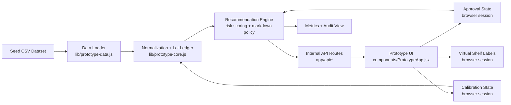
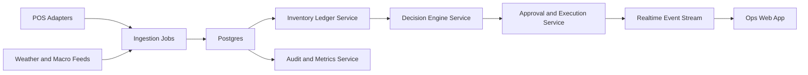

# SynaptOS Hackathon Architecture

## Purpose

This document translates the PDF vision into a buildable architecture for the current hackathon repo.

It does two things:

1. Splits the product into `v1`, `v2`, and `v3`.
2. Defines the system diagram and service boundaries for the hackathon build.

The key constraint is simple: `v1` must remain technically honest. The current repo is a deterministic markdown prototype, not a production retail operating system.

## Architecture Principles

- Keep `v1` as a single deployable web app.
- Treat inventory truth and calibration as more important than LLM autonomy.
- Prefer deterministic decisioning over opaque AI behavior.
- Preserve a full audit trail for every recommendation and override.
- Simulate integrations in `v1`; do not fake production readiness.

## Version Split

### `v1` Hackathon Prototype

Goal:

- Prove the closed loop for markdown operations on seeded data.

Capabilities:

- CSV-backed inventory and demand context
- lot derivation and inventory confidence scoring
- deterministic markdown recommendation engine
- manager approval for high-risk markdowns
- virtual shelf-label view
- calibration and audit workflow
- simulated impact reporting

Deployment shape:

- one `Next.js` application
- route handlers as internal API surface
- CSV file as seed source
- in-memory approval, label, and calibration state

Out of scope:

- real POS integrations
- procurement execution
- inter-store transfer routing
- physical E-ink hardware
- enterprise billing
- persistent auth and RBAC enforcement

### `v2` Pilot-Ready Retail Overlay

Goal:

- Move from demo loop to pilotable store operations software.

New capabilities:

- persistent operational data store
- store/user auth with enforced RBAC
- recommendation history and audit persistence
- scheduled recomputation jobs
- live update transport via SSE or WebSockets
- adapter-based POS imports
- configurable pricing policies per chain and store

Suggested deployment shape:

- still a modular monolith if team size is small
- `Postgres` instead of CSV-only state
- background worker for recomputation and sync jobs
- adapter layer for partner POS ingestion

Still out of scope:

- autonomous supplier purchasing
- cross-store routing automation
- external partner monetization APIs

### `v3` Operating System / Network Layer

Goal:

- Expand from markdown control to upstream and downstream retail execution.

New capabilities:

- predictive procurement engine
- supplier-facing PO workflow
- inter-store transfer recommendations
- EOL routing and compliance reporting
- chain-level policy engine
- partner API / white-label pricing engine
- model monitoring and experimentation loops

Suggested deployment shape:

- service-oriented system
- durable event stream for inventory, pricing, and execution events
- dedicated services for procurement, routing, reporting, and partner APIs

## Recommended Build Positioning

For this repo, the correct message is:

- `v1` is a markdown decision and execution prototype.
- `v2` is the first real store-operations product.
- `v3` is the full SynaptOS platform.

That framing is more defensible than calling the current build a full agentic retail OS.

## `v1` System Diagram

## `v1` Runtime Boundaries

### 1. Presentation Boundary

Responsibility:

- render HQ, store ops, approval queue, label wall, and audit views

Current implementation:

- `app/page.jsx`
- `components/PrototypeApp.jsx`

Inputs:

- store list
- snapshots
- recommendation runs
- approval decisions
- calibration entries

Outputs:

- approve or reject recommendation
- trigger rerun with current state
- display updated labels and metrics

### 2. API Boundary

Responsibility:

- provide a stable internal contract between UI and engine

Current implementation:

- `app/api/stores/route.js`
- `app/api/snapshots/route.js`
- `app/api/recommendations/run/route.js`

Notes:

- this is not yet a public API surface
- in `v1`, these routes are thin wrappers over local modules

### 3. Data Ingestion Boundary

Responsibility:

- load and normalize the baseline dataset
- expose stores and snapshots usable by the app

Current implementation:

- `lib/prototype-data.js`

Source of truth in `v1`:

- `SynaptOS_Data - SynaptOS_Baseline_Final_v4.csv`

Future evolution:

- replace with POS adapter imports and persisted inventory events

### 4. Inventory Ledger Boundary

Responsibility:

- derive lot-level state from imported rows
- estimate quantity on hand
- maintain confidence score
- absorb manager calibration

Current implementation:

- `lib/prototype-core.js`

Why it matters:

- this is the real core of the product
- markdown logic is only as good as the ledger and calibration loop

### 5. Decision Engine Boundary

Responsibility:

- calculate risk score
- choose markdown band
- flag cases requiring manager review
- produce outputs suitable for labels and metrics

Current implementation:

- `lib/prototype-core.js`

Decision style:

- deterministic scoring
- no autonomous free-text reasoning
- explicit guardrails around discount size and confidence

### 6. Execution Boundary

Responsibility:

- convert approved decisions into current selling prices for the prototype
- reflect price changes in the shelf-label view

Current implementation:

- browser-session state inside the prototype UI

Important limitation:

- there is no POS writeback in `v1`
- execution means internal state change plus UI propagation only

### 7. Audit and Metrics Boundary

Responsibility:

- show recommendation outcomes
- expose rescued GMV and waste-avoidance style metrics
- retain visible evidence of overrides and calibrations

Current implementation:

- derived in `lib/prototype-core.js`
- rendered in the prototype UI

## `v1` Service Boundary Table

| Boundary | Owns | Does Not Own | Current Form | `v2` Evolution |
| --- | --- | --- | --- | --- |
| Presentation | dashboard, queue, labels, audit screens | pricing logic, ingestion | React UI | richer role-aware app shell |
| API | internal request/response contract | business state persistence | Next route handlers | stable internal service API |
| Ingestion | CSV parsing, snapshot exposure | partner sync scheduling | local module | adapter layer + import jobs |
| Inventory Ledger | lot derivation, confidence, calibration effects | supplier purchasing | local module | persisted inventory event model |
| Decision Engine | markdown policy and guardrails | UI rendering | local module | configurable policy service |
| Execution | effective prototype price state | physical shelf devices, POS writeback | client state | persisted execution records + live events |
| Audit/Metrics | impact summaries and evidence trail | accounting system of record | derived view state | durable audit log + reporting tables |

## Recommended `v1` Monolith Module Map

Even though `v1` ships as one app, the code should conceptually stay split like this:

- `ui/`
  - screens, charts, role views
- `api/`
  - route handlers and request validation
- `ingestion/`
  - dataset loading and normalization
- `ledger/`
  - lot state, confidence, calibration
- `decisioning/`
  - risk scoring and markdown recommendation
- `execution/`
  - effective price state and label projection
- `reporting/`
  - metrics, rescued GMV, audit summaries

In the current repo, these boundaries are mostly compressed into:

- UI: `components/PrototypeApp.jsx`
- API: `app/api/*`
- ingestion + ledger + decisioning + reporting: `lib/prototype-data.js`, `lib/prototype-core.js`

## `v2` Target Decomposition

When the hackathon build graduates, split the monolith internally before splitting deployment:

The sequence matters:

1. Persist state first.
2. Add jobs and live updates second.
3. Add external integrations third.

## `v3` Platform Boundaries

Only split into separate deployed services when the product scope actually demands it:

- `pricing service`
- `inventory ledger service`
- `procurement service`
- `routing service`
- `partner API service`
- `reporting and compliance service`

If those boundaries are introduced too early, the team will spend the hackathon on infrastructure instead of the product loop.

## Explicit Non-Goals For The Hackathon Build

The hackathon build should not claim to implement:

- autonomous PO submission to suppliers
- production-grade inter-store logistics routing
- physical smart-label integrations
- multi-tenant enterprise controls
- full forecast modeling or MLOps
- public white-label APIs

## Build Recommendation

For this repo, the best architecture decision is:

- keep `v1` as a modular monolith
- harden the ledger and recommendation boundaries
- add persistence before adding more AI
- treat procurement, routing, and partner APIs as `v2+`

That gives the team a coherent demo now and a believable path beyond the hackathon.
