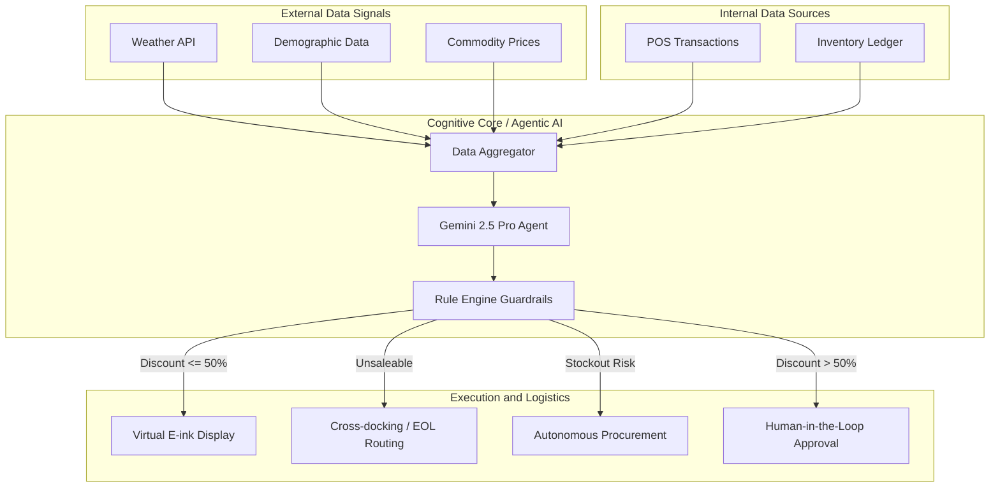

# SynaptOS Hackathon Architecture

## Purpose

This document replans SynaptOS around the architecture shown in [Screenshot 2026-04-17 at 01.55.15.png](/Users/nguyenngochoa/Git/gg-hackathon/Screenshot%202026-04-17%20at%2001.55.15.png).

It does two things:

1. anchors the current repo as the implementation base
2. defines the target control-tower architecture that the repo should evolve toward

## Architecture Principles

- aggregate facts before invoking the model
- keep execution authority in deterministic guardrails, not the LLM
- route work as typed execution tasks, not free-text suggestions
- preserve a full audit trail from source ingestion through executor result
- keep the next iteration inside a modular monolith

## Version Split

### `v2` Current Runtime

The current repo is still a durable markdown prototype:

- `Next.js` App Router UI
- internal APIs under `app/api`
- `Postgres` persistence
- deterministic scoring in `lib/prototype-core.js`
- `SSE` updates
- approval, labels, calibration, and audit history

It does not yet implement:

- a dedicated data aggregation service
- an LLM agent runtime
- logistics routing
- procurement execution

### `v3` Target Control Tower

The architecture in the image should be treated as the next target state:

- multi-source data aggregation
- agent-generated action proposals
- deterministic guardrail evaluation
- route-specific execution branches
- unified control-tower UI and metrics

## Target System Diagram

## Runtime Boundaries

### 1. Data Source Boundary

Owns:

- inbound source records
- source freshness and provenance
- external signal fixtures or adapters

Current form:

- baseline CSV import in `lib/prototype-data.js`
- persisted operational records in `lib/server/prototype-store.js`

### 2. Aggregation Boundary

Owns:

- normalized store snapshots
- source reconciliation
- inventory, pricing, stockout, and unsaleable context bundles

Current form:

- partially implicit across `lib/prototype-data.js`, `lib/prototype-core.js`, and `lib/server/prototype-store.js`

Target evolution:

- explicit `aggregation` module and APIs

### 3. Agent Boundary

Owns:

- model invocation
- structured proposal generation
- rationale summarization

Does not own:

- policy enforcement
- direct execution

Target evolution:

- provider-neutral interface with `Gemini 2.5 Pro` as the first configured model

### 4. Guardrail Boundary

Owns:

- discount thresholds
- margin floors
- source freshness requirements
- procurement and logistics eligibility rules

Does not own:

- prompt engineering
- UI rendering

Target evolution:

- explicit rule engine that converts proposals into approvals, blocks, or dispatchable tasks

### 5. Execution Boundary

Owns:

- label publication
- logistics task creation
- procurement order creation
- approval workflow state

Current form:

- labels and approvals exist in the current app

Target evolution:

- add route-specific execution records and workers inside the monolith

### 6. Control Tower Boundary

Owns:

- source freshness visibility
- proposal queue
- approval queue
- logistics and procurement worklists
- audit and impact metrics

Current form:

- current dashboard in `components/PrototypeApp.jsx`

Target evolution:

- multi-queue operational UI with stage-level visibility

## Recommended Internal Module Split

Keep the deployment monolithic, but split code ownership internally:

- `lib/server/aggregation/*`
- `lib/server/agent/*`
- `lib/server/rules/*`
- `lib/server/execution/*`
- `lib/server/metrics/*`
- `app/api/aggregation/*`
- `app/api/proposals/*`
- `app/api/execution/*`

## Sequence Recommendation

1. materialize the aggregation boundary first
2. add structured agent proposals second
3. add deterministic guardrail evaluation third
4. add route-specific executors and UI queues last

This sequence is important because the control-tower model fails if the agent is introduced before the state model and execution constraints are explicit.

## Explicit Non-Goals For The Next Iteration

Do not claim:

- direct supplier submission from day one
- production WMS or ERP integrations
- physical E-ink hardware integration
- independent microservices before the pipeline is proven
- unconstrained autonomous execution by the model

## Build Recommendation

For this repo, the architecture decision is:

- preserve the current `v2` monolith as the implementation base
- add an explicit aggregation layer
- let the model generate structured proposals only
- keep all execution decisions in the rule engine
- expand beyond markdown into logistics and procurement through typed internal tasks
