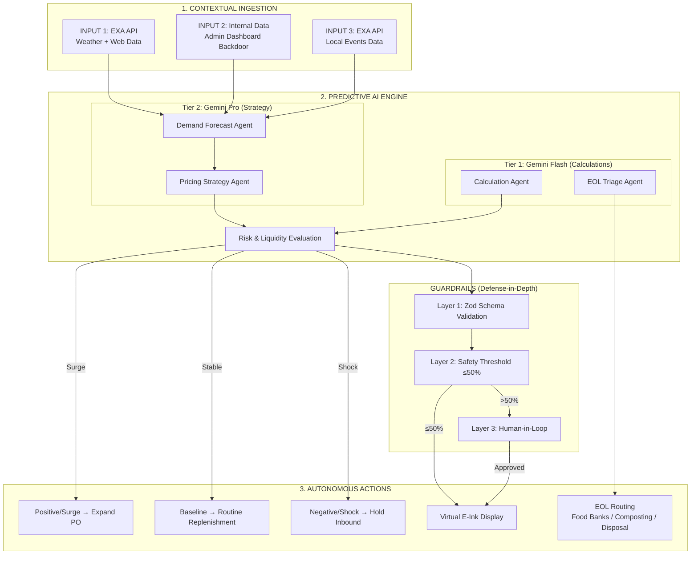

# SynaptOS Prototype Upgrade — Implementation Plan

## Goal

Build a working prototype that implements the full SynaptOS architecture from the pitch deck diagrams:
1. **Contextual Ingestion** (3 inputs: EXA web/weather, Internal data, EXA local events)
2. **Predictive AI Engine** (Multi-tier agents: Flash for calculations, Pro for strategy)
3. **Risk & Liquidity Evaluation** (Guardrails with Zod validation)
4. **Autonomous Actions** (Auto markdown, procurement, EOL routing)

## User Review Required

> [!IMPORTANT]
> - **EXA API Key** will be stored in `.env` — never committed to git
> - **Gemini API Key** is needed for the AI agents. Do you have a `GEMINI_API_KEY`? Or should we use mock mode initially?
> - The **Admin Dashboard backdoor** will be accessible at `/admin` with no auth (prototype mode) — is this acceptable?

---

## Proposed Changes

### Component 1: EXA Contextual Ingestion Service

Implements the **"1. CONTEXTUAL INGESTION"** layer from the architecture diagram.

#### [NEW] [exa-client.js](file:///c:/Users/power/Desktop/syntaptos/lib/server/ingestion/exa-client.js)
- Reusable EXA API wrapper (`POST https://api.exa.ai/search`)
- Header: `x-api-key` with the provided key
- Methods: `searchWeather(location)`, `searchEvents(location)`, `searchCommodityPrices(region)`
- Uses `type: "auto"`, `category: "news"`, date filters for freshness

#### [NEW] [weather-adapter.js](file:///c:/Users/power/Desktop/syntaptos/lib/server/ingestion/weather-adapter.js)  
- **INPUT 1**: Calls EXA to search for current weather conditions in the store's area
- Query: `"current weather conditions Ho Chi Minh City today temperature humidity"`
- Extracts: temperature, humidity, rain probability, heat index
- Normalizes into `SignalObservation` format

#### [NEW] [events-adapter.js](file:///c:/Users/power/Desktop/syntaptos/lib/server/ingestion/events-adapter.js)
- **INPUT 3**: Calls EXA to search for local events near stores
- Query: `"events festivals promotions Ho Chi Minh City this week"`
- Detects: festivals, holidays, sports events, concerts → foot traffic surges
- Normalizes into `SignalObservation` format

#### [NEW] [internal-data-adapter.js](file:///c:/Users/power/Desktop/syntaptos/lib/server/ingestion/internal-data-adapter.js)
- **INPUT 2**: Reads from admin-inputted internal data (stored in Postgres or in-memory)
- Data shape: store inventory, pricing, sales velocity, shrinkage reports
- Implements the **Inventory Ledger** from diagram 3: `True Stock = Live Stock - Shrinkage`

#### [NEW] [ingestion-orchestrator.js](file:///c:/Users/power/Desktop/syntaptos/lib/server/ingestion/ingestion-orchestrator.js)
- Runs all 3 adapters in parallel
- Merges results into a unified `ContextualSnapshot`
- Tracks freshness per source (`fresh` / `degraded` / `stale`)

---

### Component 2: Multi-Tier AI Agent Architecture

Implements the **"2. PREDICTIVE AI ENGINE"** + **"COGNITIVE CORE"** from diagrams.

#### [NEW] [agent-router.js](file:///c:/Users/power/Desktop/syntaptos/lib/server/agents/agent-router.js)
- Routes tasks to appropriate AI tier:
  - **Tier 1 (Flash)**: Inventory calculations, invoice generation, routine replenishment → `gemini-2.0-flash`
  - **Tier 2 (Pro)**: Pricing strategy, demand forecasting, risk assessment → `gemini-2.5-pro`
- Each agent call uses strict JSON output + temperature=0.0

#### [NEW] [demand-forecast-agent.js](file:///c:/Users/power/Desktop/syntaptos/lib/server/agents/demand-forecast-agent.js)
- **Tier 2 (Pro)**: Takes `ContextualSnapshot` as input
- Considers: weather, events, historical POS, demographics, day-of-week, hour-of-day
- Outputs: per-SKU demand forecast for next 4–24 hours
- Implements "Agentic Demand Forecasting" diamond from diagram 1

#### [NEW] [pricing-strategy-agent.js](file:///c:/Users/power/Desktop/syntaptos/lib/server/agents/pricing-strategy-agent.js)
- **Tier 2 (Pro)**: Takes demand forecast + inventory state
- Applies geo-demographic pricing trajectories (Premium/Transit/Residential)
- Outputs: `ActionProposal[]` with type, discount%, rationale, confidence
- Strict function calling: only `update_price` or `route_logistics`

#### [NEW] [calculation-agent.js](file:///c:/Users/power/Desktop/syntaptos/lib/server/agents/calculation-agent.js)
- **Tier 1 (Flash)**: Handles routine computations
- Inventory math: `Live Stock = (Opening + Inbound) - Checkout`
- PO quantity calculations, cost estimates
- EOL triage: hours-to-expiry classification

#### [NEW] [eol-triage-agent.js](file:///c:/Users/power/Desktop/syntaptos/lib/server/agents/eol-triage-agent.js)
- **Tier 1 (Flash)**: Implements EOL waste routing from diagram 2
- At T-Minus 4 hours: revoke from sales floor
- Quality assessment → 3 routes:
  - Safe for Human Consumption → Local Food Banks / Charities
  - Post-Expiry / Damaged → Agri-Partners / Composting
  - Contaminated / Bio-hazard → Safe Waste Disposal

---

### Component 3: Guardrails & Rule Engine Upgrade

Implements **"Anti-Hallucination Guardrails"** from diagram 4 (sequence diagram).

#### [MODIFY] [evaluate-proposal.js](file:///c:/Users/power/Desktop/syntaptos/lib/server/rules/evaluate-proposal.js)
- Add **Layer 1**: Zod schema validation of LLM output
- Add **Layer 2**: Safety threshold verification (discount ≤ 50% → auto, > 50% → block + human approval)
- Add rules: `margin_floor_violation`, `procurement_spend_cap`, `shrinkage_required`, `confidence_too_low`

#### [NEW] [zod-schemas.js](file:///c:/Users/power/Desktop/syntaptos/lib/server/rules/zod-schemas.js)
- Zod schemas for AI output validation (as shown in diagram: "Layer 1: JSON Schema Validation (Zod)")
- `ActionProposalSchema`, `PricingDecisionSchema`, `LogisticsRouteSchema`

---

### Component 4: Execution Layer

Implements **"3. AUTONOMOUS ACTIONS"** + **"4. EXECUTION & LOGISTICS LAYER"** from diagrams.

#### [MODIFY] [procurement-executor.js](file:///c:/Users/power/Desktop/syntaptos/lib/server/execution/procurement-executor.js)
- Implement 3 procurement paths from diagram 1:
  - **Positive Anomaly / Surge** → Auto-Generate PO Increase
  - **Expected Variance / Stable** → Routine Replenishment
  - **Negative Anomaly / Shock** → Hold/Decrease Inbound

#### [MODIFY] [logistics-executor.js](file:///c:/Users/power/Desktop/syntaptos/lib/server/execution/logistics-executor.js)
- Implement EOL zero waste routing from diagram 2:
  - Food banks, composting, safe disposal
  - Generate tax write-off receipts
  - ESG reporting data

---

### Component 5: Admin Dashboard (Backdoor)

**INPUT 2** admin interface for inputting sample internal data.

#### [NEW] [admin/page.jsx](file:///c:/Users/power/Desktop/syntaptos/app/admin/page.jsx)
- Protected admin page at `/admin`
- Sections:
  1. **Store Manager**: Create/edit store profiles (Premium/Transit/Residential)
  2. **Inventory Input**: Bulk input SKUs with expiry dates, quantities, prices
  3. **Shrinkage Input**: EOD shrinkage reporting (diagram 3: "Manager Shrinkage Input")
  4. **Sales Simulation**: Input mock POS transactions
  5. **Signal Monitor**: View live EXA ingestion results (weather, events)
  6. **AI Agent Console**: Trigger agent runs, view proposals, compare tiers

#### [NEW] [api/admin/internal-data/route.js](file:///c:/Users/power/Desktop/syntaptos/app/api/admin/internal-data/route.js)
- CRUD API for internal sample data
- `POST`: Bulk import inventory, transactions, store configs
- `GET`: Retrieve current state

#### [NEW] [api/admin/trigger-run/route.js](file:///c:/Users/power/Desktop/syntaptos/app/api/admin/trigger-run/route.js)
- Trigger a full pipeline run: Ingestion → Agents → Guardrails → Actions
- Returns the complete decision trace for debugging

---

### Component 6: API Routes

#### [NEW] [api/ingestion/run/route.js](file:///c:/Users/power/Desktop/syntaptos/app/api/ingestion/run/route.js)
- `POST`: Trigger contextual ingestion for a store
- Calls EXA for weather + events, merges with internal data
- Returns `ContextualSnapshot`

#### [NEW] [api/agents/forecast/route.js](file:///c:/Users/power/Desktop/syntaptos/app/api/agents/forecast/route.js)
- `POST`: Run demand forecast agent (Tier 2 Pro)

#### [NEW] [api/agents/pricing/route.js](file:///c:/Users/power/Desktop/syntaptos/app/api/agents/pricing/route.js)
- `POST`: Run pricing strategy agent (Tier 2 Pro)

#### [NEW] [api/agents/eol-triage/route.js](file:///c:/Users/power/Desktop/syntaptos/app/api/agents/eol-triage/route.js)
- `POST`: Run EOL triage agent (Tier 1 Flash)

---

### Component 7: Environment & Config

#### [MODIFY] [.env](file:///c:/Users/power/Desktop/syntaptos/.env)
```
# EXA API
EXA_API_KEY=fb2aa56a-67b3-41b5-bb27-4808dac9e1d0

# Gemini (Multi-tier)
GEMINI_API_KEY=<user-provided>
GEMINI_MODEL_PRO=gemini-2.5-pro
GEMINI_MODEL_FLASH=gemini-2.0-flash

# Agent Config
LLM_MODE=shadow
LLM_TEMPERATURE=0.0
```

#### [MODIFY] [constants.js](file:///c:/Users/power/Desktop/syntaptos/lib/server/control-tower/constants.js)
- Add `SOURCE_TYPES.LOCAL_EVENTS`
- Add `AGENT_TIERS = { FLASH: 'flash', PRO: 'pro' }`
- Add `EOL_ROUTES = { FOOD_BANK, COMPOSTING, SAFE_DISPOSAL }`

---

## Architecture Diagram (Matches User's Images)



---

## Open Questions

> [!IMPORTANT]
> 1. **Gemini API Key**: Bạn có sẵn `GEMINI_API_KEY` chưa? Nếu chưa, tôi sẽ dùng mock mode cho agent tạm thời.
> 2. **Sample area**: Khu vực sample muốn test là HCMC (Quận 1, Phú Mỹ Hưng) đúng không? Tôi sẽ cấu hình EXA queries cho khu vực này.
> 3. **Database**: Hiện Docker chưa có trên máy. Tôi sẽ dùng in-memory store cho prototype, sau đó migrate sang Postgres khi sẵn sàng. OK?

## Verification Plan

### Automated Tests
- Trigger ingestion → verify EXA returns weather + events data cho HCMC
- Trigger full pipeline → verify proposals generated with correct tiers
- Test guardrails: submit discount 60% → verify blocked + approval required
- Test EOL routing: submit T-Minus 3h item → verify food bank route

### Manual Verification
- Open `/admin` → input sample data → trigger run → see proposals in dashboard
- Compare Tier 1 (Flash) vs Tier 2 (Pro) response quality
- Verify all 3 autonomous action paths work
