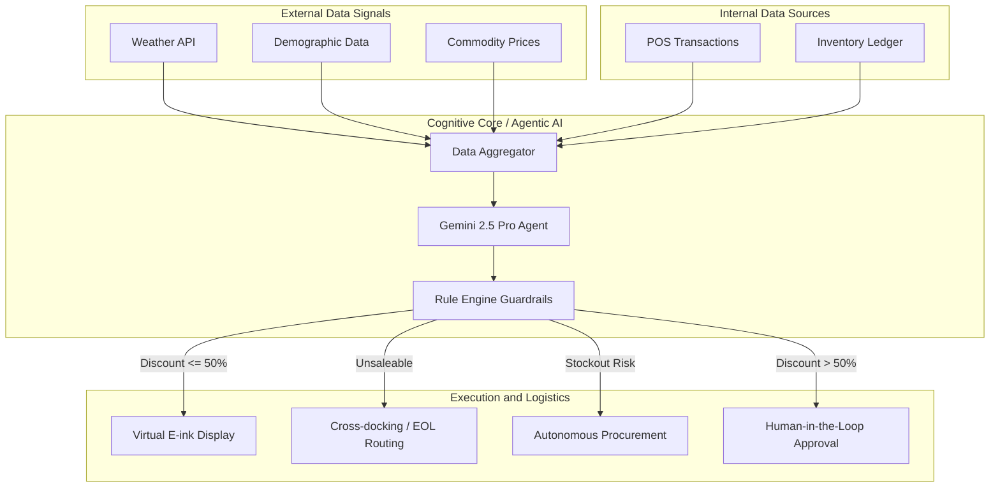

# SynaptOS Control-Tower Plan

## Planning Metadata

- Planning workflow: `bb-plan`
- Workspace root: `/Users/nguyenngochoa/Git/gg-hackathon`
- Feature directory: `/Users/nguyenngochoa/Git/gg-hackathon`
- Branch: `main`
- Source spec inputs:
  - [Screenshot 2026-04-17 at 01.55.15.png](/Users/nguyenngochoa/Git/gg-hackathon/Screenshot%202026-04-17%20at%2001.55.15.png)
  - [hackathon-architecture.md](/Users/nguyenngochoa/Git/gg-hackathon/hackathon-architecture.md)
  - [docs/system-reference.md](/Users/nguyenngochoa/Git/gg-hackathon/docs/system-reference.md)
  - `GDGoC_SynaptOS_Pitch_Deck (1).pdf`
  - `GDGoC_SynaptOS_Business_Proposal_01.pdf`
- Existing plan template: unavailable in workspace
- `constitution.md`: unavailable
- BuildBetter artifacts: unavailable

This plan treats the architecture diagram in the screenshot plus the current `v2` runtime docs as the active feature brief. There is no branch-specific spec directory or copied BuildBetter template in the workspace.

## Source Synthesis

The diagram changes the target architecture in a material way:

1. External data signals and internal retail records both flow into a shared `Data Aggregator`.
2. A frontier agent, labeled `Gemini 2.5 Pro Agent`, proposes actions from the aggregated state.
3. A deterministic `Rule Engine Guardrails` layer decides whether the proposal may execute automatically, must be routed elsewhere, or needs human review.
4. Execution is no longer markdown-only. The system branches into:
   - `Virtual E-ink Display` for discounts `<= 50%`
   - `Cross-docking / EOL Routing` for unsaleable inventory
   - `Autonomous Procurement` for stockout risk
   - `Human-in-the-Loop Approval` for discounts `> 50%`

The current repo already has three foundations that should be preserved:

- a modular monolith in `Next.js`
- a durable `Postgres` runtime store
- live UI refresh over `SSE`

The replan therefore shifts SynaptOS from a deterministic markdown engine into a bounded retail control tower built on top of the existing monolith.

## Technical Context

### Product Goal

Build the next SynaptOS architecture around this closed loop:

1. ingest external and internal retail signals
2. normalize them into one aggregated store snapshot
3. let an agent generate typed action proposals
4. enforce deterministic business guardrails before execution
5. route each approved proposal to the correct execution surface
6. emit auditable events, operator context, and downstream metrics

### Technical Decisions

- Frontend: `Next.js` App Router + `React`
- Backend: Next.js route handlers plus internal worker-style orchestration inside the monolith
- Persistence: `Postgres` via the existing `pg`-backed store
- Realtime transport: `Server-Sent Events`
- Agent runtime: provider-neutral orchestration interface with `Gemini 2.5 Pro` as the initial target model from the diagram
- Core decision pattern: `data aggregator -> agent proposal -> deterministic rule engine -> typed executor`
- Execution style: simulated downstream writes first, with internal records standing in for live procurement, routing, and label systems
- Auditability: every aggregation run, proposal, guardrail decision, approval, and execution task is persisted

### Resolved Clarifications

- The model named in the diagram is preserved in planning, but the orchestration boundary remains provider-neutral so the system is not hard-coupled to a single LLM vendor.
- `Autonomous procurement` is implemented first as bounded purchase-order creation inside SynaptOS, not direct supplier submission.
- `Cross-docking / EOL routing` is implemented first as a generated logistics task, not a live WMS integration.
- `Virtual E-ink display` remains a software execution surface before any hardware integration.
- Discounts greater than `50%` cannot auto-execute and must enter an approval queue.

## Constitution Check

### Pre-Design Check

- `constitution.md` was not found in the project root or `docs/`.
- There are no enforceable project-level constitutional gates in this workspace.
- Local planning constraints therefore apply:
  - keep the system honest about simulated versus real integrations
  - aggregate facts before invoking the agent
  - keep deterministic policy enforcement outside the model
  - require auditability for every execution route
  - preserve a modular monolith until scale forces service splits

### Post-Design Check

The revised design satisfies those constraints:

- model output cannot bypass the rule engine
- downstream integrations are planned as typed executors with simulated first implementations
- audit and replay remain first-class
- the deployment shape stays monolithic for the next implementation phase

## BuildBetter Context

No BuildBetter evidence artifacts were present:

- `buildbetter-context.md`: unavailable
- `buildbetter-context.json`: unavailable
- `user-stories.md`: unavailable

Planning evidence is therefore inferred from the image and current repository state:

- Product area: retail operations control tower
- Domain: fresh-food grocery operations
- Primary customer: chain operations leadership
- Secondary users: store managers, procurement planners, logistics operators
- Business outcome: reduce waste, recover margin, prevent stockouts, and preserve governance

## Research Summary

Detailed Phase 0 findings are captured in [research.md](/Users/nguyenngochoa/Git/gg-hackathon/research.md). The key conclusions are:

1. Introduce a fact-normalizing aggregation layer before any agent reasoning.
2. Keep `Gemini 2.5 Pro` as the initial reasoning target but hide it behind a provider-neutral interface.
3. Move all execution authority into a deterministic guardrail engine.
4. Represent the four execution branches as typed tasks, not ad hoc side effects.
5. Build the target architecture inside the current monolith first, then split services only if adoption justifies it.

## Replanned Architecture

### 1. Data Sources

External signals:

- `Weather API`
- `Demographic Data`
- `Commodity Prices`

Internal signals:

- `POS Transactions`
- `Inventory Ledger`

Prototype implementation approach:

- continue importing seeded baseline data for internal records
- simulate external feeds through scheduled pulls or fixture tables
- record freshness, provenance, and confidence for every source

### 2. Data Aggregator

Responsibilities:

- normalize source data into one store-scoped snapshot
- reconcile timing differences between feeds
- calculate source freshness and confidence
- expose a single typed payload to the agent

Outputs:

- lot risk context
- pricing context
- stockout context
- unsaleable inventory flags
- demand and cost modifiers

### 3. Agent Core

Responsibilities:

- consume the aggregated snapshot
- propose one or more typed actions with structured rationale
- classify actions into execution routes
- never execute directly

Proposal classes:

- `markdown_auto_candidate`
- `markdown_review_candidate`
- `unsaleable_route_candidate`
- `procurement_candidate`

### 4. Rule Engine Guardrails

Responsibilities:

- validate every proposal against deterministic policy
- cap discounts, procurement spend, and route eligibility
- block low-confidence or contradictory actions
- decide auto-execute versus approval required

Core rules:

- discount `<= 50%` may publish to the label executor when confidence and margin floors pass
- discount `> 50%` must create a human approval request
- unsaleable inventory may only route to approved logistics dispositions
- stockout procurement may only create bounded purchase actions for approved SKUs and suppliers

### 5. Execution and Logistics Layer

Executors:

- `Virtual E-ink Display`
- `Cross-docking / EOL Routing`
- `Autonomous Procurement`
- `Human-in-the-Loop Approval`

Execution principle:

- every executor consumes a typed task emitted by the rule engine
- each executor writes a status event and can be replayed or retried independently

### 6. Control Tower and Eventing

Responsibilities:

- surface source freshness, agent output, and guardrail decisions
- show pending approvals and execution backlog
- stream live updates to the UI
- expose audit and impact metrics by route

## Architecture Diagram

## Module Mapping To The Current Repo

The target architecture should build on the current modules as follows:

- Aggregation foundation: extend [lib/server/prototype-store.js](/Users/nguyenngochoa/Git/gg-hackathon/lib/server/prototype-store.js) and [lib/prototype-data.js](/Users/nguyenngochoa/Git/gg-hackathon/lib/prototype-data.js)
- Existing decision logic to be superseded by aggregator and guardrail modules: [lib/prototype-core.js](/Users/nguyenngochoa/Git/gg-hackathon/lib/prototype-core.js)
- Control tower APIs: extend `app/api/*`
- Live update transport: retain [lib/server/events.js](/Users/nguyenngochoa/Git/gg-hackathon/lib/server/events.js)
- Operator UX base: evolve [components/PrototypeApp.jsx](/Users/nguyenngochoa/Git/gg-hackathon/components/PrototypeApp.jsx)

## Phase Plan

### Phase 0. Research and Boundaries

Status:

- complete

Deliverables:

- final architecture choices
- guardrail policy assumptions
- execution-route definitions

Artifacts:

- [research.md](/Users/nguyenngochoa/Git/gg-hackathon/research.md)

### Phase 1. Aggregation and Data Model

Status:

- complete

Deliverables:

- aggregated snapshot schema
- action proposal schema
- execution task schema
- updated contracts and quickstart

Artifacts:

- [data-model.md](/Users/nguyenngochoa/Git/gg-hackathon/data-model.md)
- [contracts/api-contract.md](/Users/nguyenngochoa/Git/gg-hackathon/contracts/api-contract.md)
- [contracts/ui-contract.md](/Users/nguyenngochoa/Git/gg-hackathon/contracts/ui-contract.md)
- [quickstart.md](/Users/nguyenngochoa/Git/gg-hackathon/quickstart.md)

### Phase 2. Control-Tower Implementation Plan

Goal:

- evolve the current `v2` markdown runtime into the new control-tower pipeline without breaking the existing demo loop while new modules are being added

Execution strategy:

- land the new architecture behind additive modules and routes
- preserve the current deterministic recommendation flow until the new control-tower path is end-to-end functional
- switch UI surfaces incrementally rather than replacing the app in one pass

Recommended internal module split:

- `lib/server/aggregation/*`
- `lib/server/agent/*`
- `lib/server/rules/*`
- `lib/server/execution/*`
- `lib/server/metrics/*`
- `app/api/aggregation/*`
- `app/api/agent/*`
- `app/api/proposals/*`
- `app/api/execution/*`

#### Workstream 1. Persistence Foundation

Purpose:

- extend the existing `Postgres` runtime store so the new pipeline has durable first-class records

Current assets to reuse:

- [lib/server/prototype-store.js](/Users/nguyenngochoa/Git/gg-hackathon/lib/server/prototype-store.js)
- existing tables for stores, inventory, recommendations, approvals, labels, audit, and imports

New responsibilities:

- create tables for `signal_observations`, `aggregation_runs`, `aggregated_snapshots`, `agent_runs`, `action_proposals`, `guardrail_evaluations`, `approval_requests`, `execution_tasks`, `logistics_routes`, and `procurement_orders`
- add store policy columns needed by the rule engine
- add persistence helpers and repository functions for each new entity

Acceptance criteria:

- schema bootstraps cleanly on a fresh database
- existing app startup still succeeds
- new entities can be written and queried independently of the old recommendation tables

#### Workstream 2. Data Aggregator

Purpose:

- materialize the `Data Aggregator` boundary that is currently implicit across CSV import, store loading, and deterministic scoring

Current assets to reuse:

- [lib/prototype-data.js](/Users/nguyenngochoa/Git/gg-hackathon/lib/prototype-data.js)
- parts of [lib/prototype-core.js](/Users/nguyenngochoa/Git/gg-hackathon/lib/prototype-core.js) that already derive lot state, weather pressure, and velocity context

Implementation tasks:

- create `lib/server/aggregation/` modules for source loading, normalization, freshness scoring, and snapshot assembly
- support seeded internal data plus fixture-backed external feeds
- expose `POST /api/aggregation/run` and `GET /api/aggregation/runs/:id`

Acceptance criteria:

- one aggregation run creates a durable `AggregatedSnapshot`
- source freshness and provenance are visible in persisted output
- the aggregator can run without invoking the agent

#### Workstream 3. Agent Orchestration

Purpose:

- add a model boundary that produces structured proposals without taking execution authority

Current assets to reuse:

- current recommendation payload shape and lot/risk summaries from `lib/prototype-core.js`
- current route-handler pattern under `app/api/*`

Implementation tasks:

- create `lib/server/agent/client.js` and `lib/server/agent/orchestrator.js`
- define strict proposal schemas and validation
- implement `POST /api/agent/runs`
- persist `AgentRun` and `ActionProposal` records

Acceptance criteria:

- agent runs are provider-neutral at the call site
- responses are rejected if they do not match the proposal schema
- a single aggregated snapshot can produce typed proposals for markdown, approval, logistics, or procurement

#### Workstream 4. Rule Engine Guardrails

Purpose:

- make the deterministic policy layer the sole authority on execution eligibility

Current assets to reuse:

- existing approval threshold concept in stores and recommendation statuses
- RBAC helpers in [lib/server/auth.js](/Users/nguyenngochoa/Git/gg-hackathon/lib/server/auth.js)

Implementation tasks:

- create `lib/server/rules/evaluate-proposal.js`
- encode discount thresholds, margin floors, freshness checks, logistics eligibility, and procurement spend caps
- emit `GuardrailEvaluation` records
- create `ApprovalRequest` records for discounts `> 50%`

Acceptance criteria:

- no proposal can dispatch without a guardrail decision
- discounts above threshold always route to approval
- blocked proposals carry explicit rule matches and explanations

#### Workstream 5. Route-Specific Execution

Purpose:

- replace the old single execution path with typed downstream task dispatch

Current assets to reuse:

- existing label publication concepts and SSE eventing
- approval decision flow already present in the app

Implementation tasks:

- create `lib/server/execution/label-executor.js`
- create `lib/server/execution/logistics-executor.js`
- create `lib/server/execution/procurement-executor.js`
- create `app/api/execution/tasks/:id/dispatch`
- persist route-specific outputs such as `LabelDisplayUpdate`, `LogisticsRoute`, and `ProcurementOrder`

Acceptance criteria:

- `discount <= 50%` can publish to labels automatically
- `discount > 50%` must wait for human approval before dispatch
- `unsaleable` proposals create logistics tasks
- `stockout_risk` proposals create procurement orders

#### Workstream 6. Control-Tower UI and Realtime

Purpose:

- evolve the current dashboard into a stage-aware operations console

Current assets to reuse:

- [components/PrototypeApp.jsx](/Users/nguyenngochoa/Git/gg-hackathon/components/PrototypeApp.jsx)
- [app/api/events/route.js](/Users/nguyenngochoa/Git/gg-hackathon/app/api/events/route.js)
- [lib/server/events.js](/Users/nguyenngochoa/Git/gg-hackathon/lib/server/events.js)

Implementation tasks:

- add control-tower summary, proposal queue, approval console, logistics workbench, and procurement console views
- add new SSE event types for aggregation, agent runs, guardrail results, approvals, and executor completions
- keep the current markdown views live until control-tower views are verified

Acceptance criteria:

- operators can see source freshness, proposal status, and execution state separately
- approval, logistics, and procurement queues update live
- the old UI does not regress while the new views land

#### Workstream 7. Verification and Cutover

Purpose:

- prove the new path is correct before making it the primary demo flow

Implementation tasks:

- add unit coverage for aggregation, schema validation, and guardrail decisions
- add integration coverage for one full route per execution branch
- prepare seeded scenarios for:
  - auto markdown
  - human approval
  - unsaleable routing
  - stockout procurement

Acceptance criteria:

- all four execution branches have deterministic demo scenarios
- audit records exist from aggregation through execution
- the control-tower path can run end to end without relying on the legacy recommendation route

#### Recommended Delivery Order

1. persistence foundation
2. data aggregator
3. agent orchestration
4. rule engine guardrails
5. route-specific execution
6. control-tower UI and realtime
7. verification and cutover

#### Suggested Demo Cut Line

If time is constrained, the minimum credible release is:

1. aggregation + proposal + rule engine
2. label auto-execution for discounts `<= 50%`
3. approval queue for discounts `> 50%`
4. simulated logistics and procurement task creation without external dispatch

That cut line preserves the architecture truthfully even if procurement and routing remain internal task records in the first implementation wave.

## Agent Context Update

No agent-specific context file such as `AGENTS.md`, `CLAUDE.md`, or `CODEX.md` exists in the workspace, so no additional agent context file was updated.
